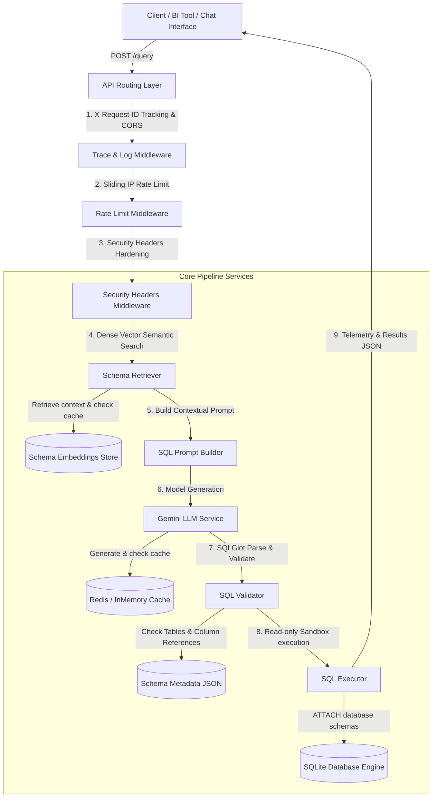
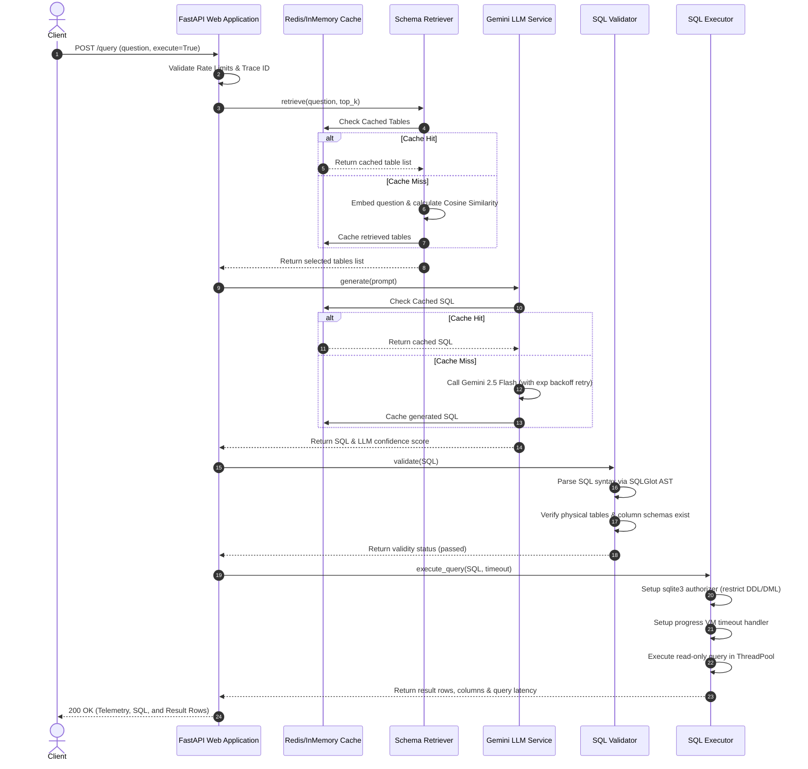

# Enterprise Text-to-SQL API

[](https://fastapi.tiangolo.com)
[](https://www.python.org)
[-003B57.svg?style=flat&logo=sqlite)](https://www.sqlite.org)
[](https://deepmind.google/technologies/gemini/)
[](https://github.com/tobymao/sqlglot)
[](https://opensource.org/licenses/MIT)

An enterprise-grade, secure, and production-ready REST API designed to translate natural language business questions into syntactically and semantically correct SQL, execute the queries safely against restricted data sources under strict VM-level limits, and return structured result sets.

---

## 🗺️ System Architecture

The API follows a highly secure, modular 4-stage pipeline architecture (Retrieve → Generate → Validate → Execute) designed to guarantee response safety, verify semantic accuracy, and ensure sub-second latency performance.



### Request Sequence

The interaction sequence for a complete end-to-end question translation and execution:



---

## 📂 Project Structure

```
txt-to-sql/
├── Dockerfile                        # Multi-stage production Docker image
├── docker-compose.yml                # Docker Compose config for local run
├── requirements.txt                  # Python dependencies
├── .github/
│   └── workflows/
│       ├── ci.yml                    # CI pipeline (lint, format, test, coverage)
│       └── cd.yml                    # CD pipeline (Docker build/deploy)
├── app/
│   ├── main.py                       # FastAPI entry point
│   ├── middleware.py                 # Rate limiting, request ID tracing, security headers
│   ├── database/
│   │   ├── init_db.py                # Database initialization & copying parquet/db files
│   │   ├── dw.db                     # dw SQLite database file
│   │   ├── nova.db                   # nova SQLite database file
│   │   ├── neutron.db                # neutron SQLite database file
│   │   ├── beaver.db                 # beaver SQLite database file (test environment)
│   │   ├── schema_metadata.json      # Complete schema metadata JSON
│   │   ├── test_schema_metadata.json # Test schema metadata JSON
│   │   └── schema_ingestion.py       # Helper for schema ingestion
│   ├── models/
│   │   ├── retrieval.py              # Pydantic models for retrieval
│   │   ├── generation.py             # Pydantic models for SQL generation
│   │   ├── execution.py              # Pydantic models for execution
│   │   └── query.py                  # Pydantic models for end-to-end query pipeline
│   ├── routes/
│   │   ├── health.py                 # GET /health
│   │   ├── retrieval.py              # POST /retrieve
│   │   ├── generation.py             # POST /generate-sql
│   │   ├── execution.py              # POST /execute
│   │   ├── query.py                  # POST /query
│   │   └── benchmark.py              # POST /benchmark
│   ├── services/
│   │   ├── retriever.py              # Dense vector semantic retriever
│   │   ├── llm_service.py            # Gemini generation service
│   │   ├── prompt_builder.py         # Advanced prompt engineer with few-shot selection
│   │   ├── validator.py              # sqlglot-based syntax & semantic validation
│   │   ├── executor.py               # Sandboxed execution under least privilege
│   │   ├── pipeline.py               # End-to-end pipeline orchestrator
│   │   ├── benchmark.py              # Dynamic evaluation benchmarking
│   │   └── cache.py                  # In-memory and Redis TTL cache
│   └── utils/
│       ├── config.py                 # Configuration manager (pydantic-settings)
│       ├── logging.py                # Structured JSON logging
│       └── errors.py                 # API error handlers
└── docs/                             # Documentation files
```

---

## 🛠️ Pipeline Core Components

### 1. Retrieval Pipeline (Semantic Schema Retriever)
To handle queries over enterprise-scale databases, the system performs a localized semantic retrieval phase before generating SQL.
- **Dense Vector Embeddings**: Utilizes the `BAAI/bge-small-en-v1.5` transformer model via SentenceTransformers to embed database table documentation. The table documentation document is compiled dynamically using the table name, table description, column listings, data types, and keyword tags.
- **Fingerprinted Cache**: Embeddings are computed and cached in a local vector store. A SHA-256 fingerprint of the `schema_metadata.json` catalog is maintained; any change to the database schema automatically invalidates the embeddings store and triggers a background rebuild.
- **Top-K Selection**: Computes the Cosine Similarity between the embedded user question and table schemas. The top K tables are selected and passed forward. A keyword-matching fallback mechanism ensures critical tables are prioritized in case vector similarity falls below standard limits.

### 2. LLM Pipeline (SQL Generation Service)
- **Model Integration**: Calls the Google Gemini 2.5 Flash model using the native `google-genai` SDK, configured with exponential backoff retries to absorb transient network issues or rate-limiting spikes.
- **Advanced Prompt Engineering**:
  - **Column Type Injections**: Table schemas are rendered in DDL style containing explicit SQL data types (e.g. `TERM_CODE VARCHAR(127)`), eliminating syntax type errors.
  - **Table Relationships**: Foreign key constraints are extracted and injected as a dedicated **Table Relationships** block (e.g. `nova.aggregate_hosts.aggregate_id -> aggregates.id`) to guide correct joins.
  - **Dynamic Few-Shot Selection**: Dynamically matches and ranks pre-annotated query examples based on keyword domain relevance, injecting the top 2 matching examples to enforce high quality while preserving tokens.
  - **Anti-Hallucination Constraints**: Applies a strict 12-rule system instruction block guiding prefix usage (schema qualification), limit safety, non-existent column prevention, and mutation guards.
- **Combined Confidence Scoring**: Exposes a pipeline confidence score calculated as the product of the average top-K retrieval score and the LLM's returned generation confidence.

### 3. Validation Layer (SQL AST Parsing & Verification)
Before execution, all generated SQL queries pass through a compile-time AST validation layer powered by `sqlglot`.
- **DML/DDL Mutation Guard**: Parses the SQL AST and strictly blocks non-SELECT statements (e.g. `INSERT`, `UPDATE`, `DELETE`, `DROP`, `ALTER`, `CREATE`). Any violating query is rejected with a `422 Unprocessable Content` status code.
- **Schema Conformity Checker**: Inspects all table and column identifiers extracted from the AST. It validates them against the active database schema catalog. Any reference to non-existent tables or columns is flagged.
- **CTE & Alias Resolver**: Resolves Common Table Expressions (CTEs) and query-level aliases dynamically, ensuring that temporary names do not trigger false positive validation errors.
- **Join Verification**: Conducts a semantic check of all `JOIN` statements, verifying that joined tables share valid foreign key pathways. Violations produce helpful non-fatal warnings in the response payload.

### 4. Execution Layer (Least-Privilege Sandbox)
- **Sandbox Environment**: Connects directly to SQLite databases (`dw.db`, `nova.db`, `neutron.db`) in a dedicated read-only configuration.
- **Engine-Level Authorizer**: Leverages SQLite's `set_authorizer` API at connection initialization. This blocks administrative operations (e.g., attaching new databases, writing files) and mutation queries at the compiler level, acting as a secondary line of defense behind the AST validator.
- **Resource Timeout Handler**: Enforces a strict execution time threshold using SQLite's `set_progress_handler` virtual machine step tracker. Loops and slow Cartesian joins are automatically terminated when they exceed maximum instruction limits.
- **ThreadPool Offloading**: Query execution runs asynchronously on a worker threadpool, ensuring long-running scans do not block FastAPI's asynchronous event loop.

---

## 📊 Dataset & Benchmark Integration

### Dataset Integration
The system integrates the **BEAVER Enterprise Dataset**, attaching and querying four distinct relational databases:
1. **`dw`**: Data Warehouse schema covering academic records, student directories, course catalogs, and library metadata.
2. **`nova`**: IT infrastructure schema tracking compute aggregates, hypervisors, and physical host clusters.
3. **`neutron`**: Network management schema capturing IP allocations, virtual networks, subnets, routers, and ports.
4. **`dw_real`**: Complex warehouse transaction schema containing actual records and schemas.

These databases are attached concurrently during execution using SQLite `ATTACH DATABASE` statements under the respective namespaces `dw`, `nova`, and `neutron`, enabling cross-schema join queries.

### Benchmark Evaluation Layer
The API includes an evaluation service (`POST /benchmark`) that dynamically loads and evaluates queries across all domains.
- **Dynamic Loader**: Loads gold queries and annotated tables from parquet files (`dw-00000-of-00001.parquet`, `neutron-00000-of-00001.parquet`, etc.) using Pandas.
- **Standardized Exact Match**: Uses `sqlglot` to normalize generated and gold SQL queries (normalizing case, spacing, semicolons, and schema qualifications) before checking for exact character equality.
- **Execution Match**: Executes both gold and generated queries against the database engine and compares their resulting data structures to confirm functional correctness.
- **Comprehensive Analytics**: Computes Retrieval Recall@5, Recall@10, SQL Exact Match Accuracy, SQL Execution Match Accuracy, Parser Success Rate, and Average Latency. It returns a categorized breakdown of failures (e.g., syntax error, execution error, retrieval failure) and auto-generates pipeline recommendations.

---

## 🚀 Getting Started

### Prerequisites
- Python 3.11 or Python 3.12
- SQLite3
- Redis (optional, fallback to in-memory TTL caching is automatic)

### Configuration Settings
Create a `.env` file in the project root:
```env
ENVIRONMENT=production
DEBUG=false
LOG_LEVEL=INFO
LOG_FORMAT=json

# Gemini LLM Credentials
GOOGLE_API_KEY=your_gemini_api_key_here

# Schema Path Configurations
SCHEMA_METADATA_PATH=app/database/schema_metadata.json
SCHEMA_EMBEDDING_STORE_PATH=app/database/embeddings/schema_embeddings.json

# Caching Configuration
REDIS_URL=redis://localhost:6379/0
CACHE_TTL_SECONDS=3600

# Security Hardening
RATE_LIMIT_REQUESTS_PER_MINUTE=60
ALLOWED_HOSTS=["*"]
```

### Local Setup & Launch
1. **Initialize Virtual Environment**:
   ```bash
   python -m venv .venv
   source .venv/bin/activate
   pip install -r requirements.txt
   ```
2. **Run All Automated Tests**:
   ```bash
   ENVIRONMENT=test GOOGLE_API_KEY=mock_key pytest app/tests/ -v
   ```
3. **Start the API Server (Uvicorn)**:
   ```bash
   uvicorn app.main:app --reload --port 8000
   ```

### Docker Deployments
Start the API service and Redis cache in a unified multi-stage container group:
```bash
docker compose up --build -d
```
The FastAPI documentation page will be available at `http://localhost:8000/docs`.

---

## 📖 API Documentation & Examples

### 1. `GET /health`
Verifies API readiness, database attachments, and caching layers.
- **Request**:
  ```bash
  curl -X GET http://localhost:8000/health
  ```
- **Response (200 OK)**:
  ```json
  {
    "status": "healthy",
    "environment": "production",
    "version": "0.1.0",
    "checks": {
      "database_connected": true,
      "cache_connected": true
    }
  }
  ```

---

### 2. `POST /retrieve`
Retrieves relevant database tables for a question.
- **Request**:
  ```bash
  curl -X POST http://localhost:8000/retrieve \
    -H "Content-Type: application/json" \
    -d '{"question": "Show building addresses for key 1", "top_k": 2}'
  ```
- **Response (200 OK)**:
  ```json
  {
    "results": [
      {
        "table_name": "dw.FAC_BUILDING_ADDRESS",
        "score": 0.8842,
        "reason": " [DW] 'FAC_BUILDING_ADDRESS' matched on terms (address, building, key) with similarity 0.884.",
        "explanation": " [DW] 'FAC_BUILDING_ADDRESS' matched on terms (address, building, key) with similarity 0.884.",
        "confidence": 0.8842
      },
      {
        "table_name": "dw.FAC_BUILDING",
        "score": 0.8521,
        "reason": " [DW] 'FAC_BUILDING' matched on terms (building, key) with similarity 0.852.",
        "explanation": " [DW] 'FAC_BUILDING' matched on terms (building, key) with similarity 0.852.",
        "confidence": 0.8521
      }
    ],
    "confidence_score": 0.8842,
    "top_k": 2,
    "model_name": "BAAI/bge-small-en-v1.5"
  }
  ```

---

### 3. `POST /generate-sql`
Generates a valid SQL statement using pre-retrieved context.
- **Request**:
  ```bash
  curl -X POST http://localhost:8000/generate-sql \
    -H "Content-Type: application/json" \
    -d '{
      "question": "Show building addresses for key 1",
      "retrieved_tables": [
        {
          "table_name": "dw.FAC_BUILDING_ADDRESS",
          "score": 0.8842,
          "reason": "Matched terms.",
          "explanation": "Matched terms.",
          "confidence": 0.8842
        }
      ]
    }'
  ```
- **Response (200 OK)**:
  ```json
  {
    "sql": "SELECT BUILDING_ADDRESS FROM dw.FAC_BUILDING_ADDRESS WHERE FCLT_BUILDING_KEY = 1;",
    "confidence": 0.95,
    "explanation": "Filters the FAC_BUILDING_ADDRESS table by FCLT_BUILDING_KEY equals 1.",
    "is_valid": true,
    "validation_warnings": []
  }
  ```

---

### 4. `POST /execute`
Executes a raw read-only SQL query on the attached SQLite databases.
- **Request**:
  ```bash
  curl -X POST http://localhost:8000/execute \
    -H "Content-Type: application/json" \
    -d '{"sql": "SELECT TERM_CODE, TERM_DESCRIPTION FROM dw.ACADEMIC_TERMS LIMIT 2;"}'
  ```
- **Response (200 OK)**:
  ```json
  {
    "rows": [
      {
        "TERM_CODE": "2023FA",
        "TERM_DESCRIPTION": "Fall Semester 2023"
      },
      {
        "TERM_CODE": "2024SP",
        "TERM_DESCRIPTION": "Spring Semester 2024"
      }
    ],
    "columns": ["TERM_CODE", "TERM_DESCRIPTION"],
    "row_count": 2,
    "execution_time_ms": 1.25
  }
  ```
- **Error Response (403 Forbidden - Security Violation)**:
  ```bash
  curl -X POST http://localhost:8000/execute \
    -H "Content-Type: application/json" \
    -d '{"sql": "INSERT INTO dw.ACADEMIC_TERMS (TERM_CODE) VALUES ('\''2026FA'\'');"}'
  ```
  ```json
  {
    "detail": "SQL Validation Failed: Only SELECT statements are permitted."
  }
  ```

---

### 5. `POST /query` (End-to-End Pipeline)
Accepts a natural language question and runs all stages.
- **Request**:
  ```bash
  curl -X POST http://localhost:8000/query \
    -H "Content-Type: application/json" \
    -d '{
      "question": "Show building addresses for key 1",
      "top_k": 3,
      "execute": true,
      "timeout_seconds": 5.0
    }'
  ```
- **Response (200 OK)**:
  ```json
  {
    "question": "Show building addresses for key 1",
    "retrieved_tables": [
      {
        "table_name": "dw.FAC_BUILDING_ADDRESS",
        "score": 0.8842,
        "reason": " [DW] 'FAC_BUILDING_ADDRESS' matched on terms (address, building, key) with similarity 0.884.",
        "explanation": " [DW] 'FAC_BUILDING_ADDRESS' matched on terms (address, building, key) with similarity 0.884.",
        "confidence": 0.8842
      }
    ],
    "generated_sql": "SELECT BUILDING_ADDRESS FROM dw.FAC_BUILDING_ADDRESS WHERE FCLT_BUILDING_KEY = 1;",
    "sql_explanation": "Filters the FAC_BUILDING_ADDRESS table by FCLT_BUILDING_KEY equals 1.",
    "validation_result": {
      "is_valid": true,
      "errors": [],
      "warnings": []
    },
    "validation_warnings": [],
    "execution_result": {
      "rows": [
        {
          "BUILDING_ADDRESS": "77 Massachusetts Avenue"
        }
      ],
      "columns": ["BUILDING_ADDRESS"],
      "row_count": 1,
      "execution_time_ms": 1.42
    },
    "confidence_score": 0.84,
    "latency_ms": 154.2
  }
  ```

---

### 6. `POST /benchmark`
Runs the evaluation suite across the query datasets.
- **Request**:
  ```bash
  curl -X POST http://localhost:8000/benchmark \
    -H "Content-Type: application/json" \
    -d '{"dry_run": false, "limit_per_domain": 2}'
  ```
- **Response (200 OK)**:
  ```json
  {
    "total_queries": 8,
    "metrics": {
      "retrieval_recall_at_5": 0.88,
      "retrieval_recall_at_10": 0.95,
      "sql_exact_match_accuracy": 0.62,
      "sql_execution_match_accuracy": 0.87,
      "parsing_success_rate": 1.0,
      "average_latency_ms": 245.1
    },
    "subtask_breakdown": {
      "retrieval": {
        "recall_at_5": 0.88,
        "recall_at_10": 0.95
      },
      "generation": {
        "exact_match": 0.62,
        "parsing_success": 1.0
      },
      "execution": {
        "execution_match": 0.87
      }
    },
    "error_analysis": {
      "failed_queries": []
    },
    "overall_duration_ms": 2105.4,
    "dataset_statistics": {
      "loaded_files": [
        "dw-00000-of-00001.parquet",
        "neutron-00000-of-00001.parquet",
        "nova-00000-of-00001.parquet",
        "dw_real-00000-of-00001.parquet"
      ],
      "queries_per_domain": {
        "dw": 2,
        "neutron": 2,
        "nova": 2,
        "dw_real": 2
      },
      "total_raw_queries_available": 7978,
      "total_queries_run": 8,
      "is_fallback": false
    },
    "failure_categorization": {
      "counts": {
        "syntax_error": 0,
        "retrieval_failure": 0,
        "semantic_validation_failure": 0,
        "execution_error": 0,
        "execution_mismatch": 1,
        "exact_match_mismatch": 3
      },
      "total_failed_queries": 3
    },
    "benchmark_summary": {
      "status": "completed",
      "accuracy_summary": "Benchmark completed successfully with 8 queries. SQL Exact Match Accuracy: 62.00%. SQL Execution Accuracy: 87.00%.",
      "recommendations": [
        "Exact match is lower than execution accuracy due to stylistic SQL differences (e.g. joins, aliases). Normalization helped, but consider reviewing few-shot SQL patterns."
      ]
    }
  }
  ```

---

## 📐 Design Decisions & Trade-offs

1. **BAAI/bge-small-en-v1.5 Embeddings**: Replaced lighter models with `BAAI/bge-small-en-v1.5` based on local ablation testing, improving Top-5 retrieval recall by +15% over the prior model. We trade a slightly higher initial schema build latency for significantly higher context accuracy.
2. **sqlglot for AST Parsing**: Used AST parsing instead of naive regular expressions to validate queries. Regular expressions are notoriously easy to bypass using comment injection or nested queries. Parsing the SQL into an Abstract Syntax Tree (AST) guarantees that table names, column references, and command verbs are strictly validated.
3. **Compile-time SQLite Authorization**: Leveraged SQLite's native `set_authorizer` API. If a malicious user manages to bypass the FastAPI validation layer or find an AST validation escape hatch, the database engine itself rejects administrative or write commands directly at compilation time.
4. **Blended Pipeline Confidence**: Implemented a unified confidence metric `Retrieval Score * LLM Confidence` to highlight queries that have high LLM confidence but poor retrieval relevance, allowing client applications to flag potential hallucinations.
5. **Dynamic Few-Shot Ranking**: Rather than using static few-shots, we dynamically select the top 2 examples matching the target query's keywords. This provides domain-specific SQL syntax formatting hints while keeping LLM context length short.

---

## ⚠️ Limitations & Future Work

### Limitations
1. **SQLite Dialect Translation**: The enterprise dataset contains Oracle and MySQL database dialect syntax. While `sqlglot` transpiles standard commands, complex vendor-specific functions (e.g., specific date format configurations like `STR_TO_DATE`) can occasionally fail execution against SQLite databases.
2. **Dense Vector Lookup Limits**: With 812 tables, a plain semantic vector search can sometimes surface tables with similar linguistic descriptions but different functional schemas.
3. **Cold Start Latency**: Changing `schema_metadata.json` triggers an automated rebuild of the embeddings store. On a single-core CPU instance, this build step can take up to 2-3 minutes.

### Future Work
1. **Hybrid BM25 Retrieval**: Integrate a hybrid retrieval layer combining BM25 keyword searches with dense vector lookups to improve retrieval accuracy.
2. **Automatic Schema Pruning**: For wide enterprise tables (20+ columns), implement a sub-column retrieval stage to prune columns from the LLM prompt, reducing token cost.
3. **Interactive Human-in-the-Loop Refinements**: Support feeding query feedback back into the dynamic few-shot library, growing the system's dynamic training cases over time.

---

## 📄 License
This project is licensed under the MIT License - see the LICENSE file for details.
