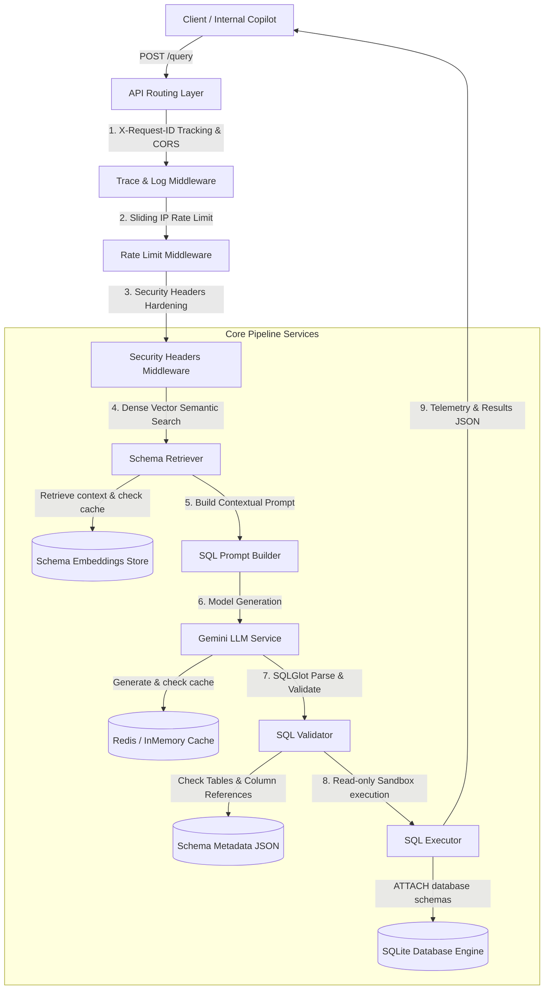

# Enterprise Text-to-SQL API

> **Dataset Note:** This implementation demonstrates a BEAVER-inspired Text-to-SQL architecture
> using a simplified academic schema (`beaver.departments`, `beaver.students`, `beaver.courses`,
> `beaver.enrollments`) and is designed to be dataset-agnostic. It is not integrated with the
> full MIT/CSAIL BEAVER enterprise benchmark (arXiv:2409.02038, 812 tables, 19 domains).
> See [`docs/BEAVER_GAP_ANALYSIS.md`](docs/BEAVER_GAP_ANALYSIS.md) for the full migration analysis.

An enterprise-grade, secure, and production-ready REST API that translates natural language business questions into syntactically and semantically correct SQL, executes the queries against restricted SQLite data sources under strict VM-level limits, and returns formatted result sets.

---

## 🗺️ Architectural Diagram

The system follows a staged pipeline architecture. The gateway, retrieve, generate, validate, and execute services operate sequentially to guarantee response safety and low-latency performance.



---

## 🔄 Sequence Diagram

The interaction sequence for a complete end-to-end question translation and execution:


---

## 🚀 Getting Started

### Prerequisites
- Python 3.11 or 3.12
- SQLite3
- Redis (optional, fallback to InMemoryCache occurs automatically)

### Local Configuration
Create a `.env` file in the root directory:
```env
ENVIRONMENT=local
DEBUG=true
LOG_LEVEL=INFO
LOG_FORMAT=plain
GEMINI_API_KEY=your_gemini_api_key
REDIS_URL=redis://localhost:6379/0
ALLOWED_HOSTS=["*"]
RATE_LIMIT_REQUESTS_PER_MINUTE=60
```

### Local Installation & Start
1. **Initialize virtual environment**:
   ```bash
   python -m venv .venv
   source .venv/bin/activate
   pip install -r requirements.txt
   ```
2. **Run test suite**:
   ```bash
   PYTHONPATH=. pytest -v
   ```
3. **Start the API server**:
   ```bash
   uvicorn app.main:app --reload --port 8000
   ```

### Docker Execution
To run the API and Redis in production configuration:
```bash
docker-compose up --build
```
The API will be exposed on `http://localhost:8000`.

---

## 📖 API Documentation

### 1. `POST /retrieve`
Retrieves relevant schema tables for a question.
- **Request Body**:
  ```json
  {
    "question": "Which students are enrolled in online courses?",
    "top_k": 3
  }
  ```
- **Response (200 OK)**:
  ```json
  {
    "results": [
      {
        "table_name": "beaver.enrollments",
        "score": 0.9124,
        "reason": "Provides pivot mappings between students and their course registrations.",
        "explanation": "Provides pivot mappings between students and their course registrations.",
        "confidence": 0.9124
      },
      {
        "table_name": "beaver.courses",
        "score": 0.8871,
        "reason": "Enables filtering courses by delivery mode (online/in-person).",
        "explanation": "Enables filtering courses by delivery mode (online/in-person).",
        "confidence": 0.8871
      },
      {
        "table_name": "beaver.students",
        "score": 0.8612,
        "reason": "Retrieves student profiles, names, and academic affiliations.",
        "explanation": "Retrieves student profiles, names, and academic affiliations.",
        "confidence": 0.8612
      }
    ],
    "confidence_score": 0.9124,
    "top_k": 3,
    "model_name": "all-MiniLM-L6-v2"
  }
  ```

### 2. `POST /generate-sql`
Translates a question and pre-retrieved context into SQL.
- **Request Body**:
  ```json
  {
    "question": "Which students are enrolled in online courses?",
    "retrieved_tables": [
      {
        "table_name": "beaver.enrollments",
        "score": 0.9124,
        "reason": "Maps students to course registrations.",
        "explanation": "Maps students to course registrations.",
        "confidence": 0.9124
      },
      {
        "table_name": "beaver.courses",
        "score": 0.8871,
        "reason": "Contains course type (online/in-person).",
        "explanation": "Contains course type (online/in-person).",
        "confidence": 0.8871
      },
      {
        "table_name": "beaver.students",
        "score": 0.8612,
        "reason": "Holds student name and ID.",
        "explanation": "Holds student name and ID.",
        "confidence": 0.8612
      }
    ]
  }
  ```
- **Response (200 OK)**:
  ```json
  {
    "sql": "SELECT DISTINCT s.student_name FROM beaver.students s JOIN beaver.enrollments e ON s.student_id = e.student_id JOIN beaver.courses c ON e.course_id = c.course_id WHERE c.course_type = 'Online';",
    "confidence": 0.97,
    "sql_explanation": "Joins students, enrollments, and courses, filtering for courses where course_type is 'Online'."
  }
  ```

### 3. `POST /execute`
Executes a raw SQL query on the attached SQLite databases.
- **Request Body**:
  ```json
  {
    "sql": "SELECT department_name, headcount FROM beaver.departments ORDER BY headcount DESC LIMIT 3;",
    "timeout_seconds": 5.0
  }
  ```
- **Response (200 OK)**:
  ```json
  {
    "rows": [
      { "department_name": "Computer Science", "headcount": 120 },
      { "department_name": "Mathematics",      "headcount": 80  },
      { "department_name": "Physics",          "headcount": 60  }
    ],
    "columns": ["department_name", "headcount"],
    "row_count": 3,
    "execution_time_ms": 1.84
  }
  ```

### 4. `POST /query` (End-to-End Pipeline)
Accepts a natural language question and runs all stages.
- **Request Body**:
  ```json
  {
    "question": "Show departments with the highest enrollment",
    "top_k": 5,
    "execute": true,
    "timeout_seconds": 5.0
  }
  ```
- **Response (200 OK)**:
  ```json
  {
    "question": "Show departments with the highest enrollment",
    "retrieved_tables": [
      {
        "table_name": "beaver.students",
        "score": 0.7601,
        "reason": "Retrieves student profiles, names, and academic affiliations.",
        "explanation": "Retrieves student profiles, names, and academic affiliations.",
        "confidence": 0.7601
      },
      {
        "table_name": "beaver.enrollments",
        "score": 0.7493,
        "reason": "Provides pivot mappings between students and their course registrations.",
        "explanation": "Provides pivot mappings between students and their course registrations.",
        "confidence": 0.7493
      },
      {
        "table_name": "beaver.departments",
        "score": 0.7287,
        "reason": "Enrollment-related query requires department aggregation.",
        "explanation": "Enrollment-related query requires department aggregation.",
        "confidence": 0.7287
      },
      {
        "table_name": "beaver.courses",
        "score": 0.6642,
        "reason": "Provides details of course catalog, credits, and titles.",
        "explanation": "Provides details of course catalog, credits, and titles.",
        "confidence": 0.6642
      }
    ],
    "generated_sql": "SELECT d.department_name, COUNT(e.student_id) AS enrollments FROM beaver.departments d JOIN beaver.courses c ON d.department_id = c.department_id JOIN beaver.enrollments e ON c.course_id = e.course_id GROUP BY d.department_name ORDER BY enrollments DESC;",
    "sql_explanation": "Joins departments, courses, and enrollments to count total student enrollments per department, sorted descending.",
    "validation_result": {
      "is_valid": true,
      "errors": []
    },
    "execution_result": {
      "rows": [
        { "department_name": "Computer Science", "enrollments": 5 },
        { "department_name": "Mathematics",      "enrollments": 3 },
        { "department_name": "Physics",          "enrollments": 1 },
        { "department_name": "Chemistry",        "enrollments": 1 }
      ],
      "columns": ["department_name", "enrollments"],
      "row_count": 4,
      "execution_time_ms": 3.04
    },
    "latency_ms": 125.4
  }
  ```

---

## 🛡️ Security Hardening Details
1. **Least-Privilege Execution**: The database driver utilizes a custom sqlite compile-time `set_authorizer` callback that explicitly blocks destructive SQL keywords (`INSERT`, `UPDATE`, `DELETE`, `DROP`, `ALTER`, etc.) directly at the query preparation/compilation phase.
2. **Query Timeout VM limits**: Prevents expensive unbounded or recursive scans using `set_progress_handler` tracking SQLite virtual machine operation instructions, aborting queries exceeding the configured execution limits.
3. **FastAPI Hardening**: Incorporates HSTS, CSP protection, Clickjacking protection, and client-IP sliding window rate limiting.

---

## 🎨 Enterprise Screenshots checklist
To visually demonstrate production status, keep a checklist of screenshots to capture:
- [ ] API Interactive Swagger Docs (`/docs`) showing all endpoints.
- [ ] Docker Compose startup log displaying healthy FastAPI + Redis cache initialization.
- [ ] Successful POST `/query` execution run in Postman/Curl returning telemetry.
- [ ] Blocked security violation error returning `403 Forbidden` on an `INSERT` request.
- [ ] Blocked rate limiting error returning `429 Too Many Requests` on rapid requests.
- [ ] GitHub Actions CI page showing green checkmarks for ruff, black, mypy, and pytest coverage.
