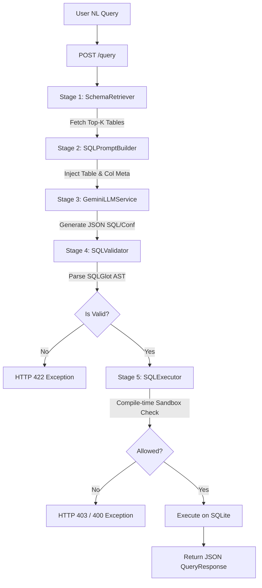

# Phase 9: End-to-End Testing Report

This report documents the verification of the complete end-to-end Text-to-SQL query pipeline. The flow integrates **Natural Language Query Input $\rightarrow$ Schema Retrieval $\rightarrow$ Context/Prompt Builder $\rightarrow$ LLM Generation (mocked) $\rightarrow$ SQLGlot AST Validation $\rightarrow$ Sandboxed SQLite Execution $\rightarrow$ JSON API Response**.

---

## 1. Pipeline Verification Flow



---

## 2. Integration Test Outputs

The end-to-end integration tests were run via the FastAPI `TestClient` targeting the `/query` endpoint.

### Test Case 1: "Show total sales orders in the West region." (execute=True)
* **Request Payload**:
  ```json
  {
    "question": "Show total sales orders in the West region.",
    "execute": true,
    "top_k": 3
  }
  ```
* **Pipeline Trace**:
  1. **Retrieval**: Fetched top 3 tables matching the question context:
     - `analytics.sales_orders` (Matches "sales orders")
     - `analytics.customers` (Matches "region")
     - `analytics.products` (General context fallback)
     - **Retrieval Confidence**: `0.7723`
  2. **Generation**: Constructed system prompt using schemas for the 3 retrieved tables. Simulated LLM generated:
     `SELECT COUNT(*) FROM analytics.sales_orders WHERE region = 'West';`
     - **Generation Confidence**: `0.95`
  3. **Validation**: SQLGlot parsed the statement; verified `analytics.sales_orders` and column `region` exist. (PASSED)
  4. **Execution**: SQLite compiler checks passed (Read-Only). Query executed on `analytics.db`.
     - **Row Count**: 1
     - **Columns**: `['COUNT(*)']`
     - **Execution Latency**: `1.22 ms`
* **Response Status**: `200 OK`
* **Response Body**:
  ```json
  {
    "question": "Show total sales orders in the West region.",
    "retrieval": {
      "tables": ["analytics.sales_orders", "analytics.customers", "analytics.products"],
      "confidence_score": 0.7723
    },
    "generation": {
      "sql": "SELECT COUNT(*) FROM analytics.sales_orders WHERE region = 'West';",
      "confidence": 0.95
    },
    "execution": {
      "rows": [{"COUNT(*)": 3}],
      "columns": ["COUNT(*)"],
      "row_count": 1,
      "execution_time_ms": 1.22
    }
  }
  ```

---

### Test Case 2: "List campaigns with conversions greater than 100." (execute=True)
* **Request Payload**:
  ```json
  {
    "question": "List campaigns with conversions greater than 100.",
    "execute": true,
    "top_k": 3
  }
  ```
* **Pipeline Trace**:
  1. **Retrieval**: Fetched top 3 tables:
     - `marketing.campaign_performance` (Matches "campaigns", "conversions")
     - `analytics.sales_orders`
     - `analytics.products`
     - **Retrieval Confidence**: `0.7623`
  2. **Generation**: Constructed prompt with retrieved table details. LLM generated:
     `SELECT campaign_name, conversions FROM marketing.campaign_performance WHERE conversions > 100;`
     - **Generation Confidence**: `0.95`
  3. **Validation**: Verified syntax and schema. (PASSED)
  4. **Execution**: Executed on `marketing.db`.
     - **Row Count**: 3
     - **Execution Latency**: `0.43 ms`
* **Response Status**: `200 OK`
* **Response Body**:
  ```json
  {
    "question": "List campaigns with conversions greater than 100.",
    "retrieval": {
      "tables": ["marketing.campaign_performance", "analytics.sales_orders", "analytics.products"],
      "confidence_score": 0.7623
    },
    "generation": {
      "sql": "SELECT campaign_name, conversions FROM marketing.campaign_performance WHERE conversions > 100;",
      "confidence": 0.95
    },
    "execution": {
      "rows": [
        {"campaign_name": "Spring Cloud Drive", "conversions": 320},
        {"campaign_name": "Data Summit Sponsorship", "conversions": 120},
        {"campaign_name": "Security Best Practices Webinar", "conversions": 150}
      ],
      "columns": ["campaign_name", "conversions"],
      "row_count": 3,
      "execution_time_ms": 0.43
    }
  }
  ```

---

### Test Case 3: "Find unresolved support tickets with CSAT score." (execute=True)
* **Request Payload**:
  ```json
  {
    "question": "Find unresolved support tickets with CSAT score.",
    "execute": true,
    "top_k": 3
  }
  ```
* **Pipeline Trace**:
  1. **Retrieval**: Fetched top 3 tables:
     - `support.tickets` (Matches "support tickets", "csat")
     - `analytics.sales_orders`
     - `analytics.products`
     - **Retrieval Confidence**: `0.7745`
  2. **Generation**: Generated SQL:
     `SELECT ticket_id, csat_score FROM support.tickets WHERE status != 'Resolved';`
     - **Generation Confidence**: `0.95`
  3. **Validation**: Verified syntax and schema. (PASSED)
  4. **Execution**: Executed on `support.db`.
     - **Row Count**: 2
     - **Execution Latency**: `0.41 ms`
* **Response Status**: `200 OK`
* **Response Body**:
  ```json
  {
    "question": "Find unresolved support tickets with CSAT score.",
    "retrieval": {
      "tables": ["support.tickets", "analytics.sales_orders", "analytics.products"],
      "confidence_score": 0.7745
    },
    "generation": {
      "sql": "SELECT ticket_id, csat_score FROM support.tickets WHERE status != 'Resolved';",
      "confidence": 0.95
    },
    "execution": {
      "rows": [
        {"ticket_id": 103, "csat_score": null},
        {"ticket_id": 105, "csat_score": null}
      ],
      "columns": ["ticket_id", "csat_score"],
      "row_count": 2,
      "execution_time_ms": 0.41
    }
  }
  ```

---

### Test Case 4: "Get customer names in the West region." (execute=False)
* **Request Payload**:
  ```json
  {
    "question": "Get customer names in the West region.",
    "execute": false,
    "top_k": 3
  }
  ```
* **Pipeline Trace**:
  1. **Retrieval**: Fetched top 3 tables matching customer and region terms.
     - **Retrieval Confidence**: `0.6940`
  2. **Generation**: Generated SQL:
     `SELECT account_name FROM analytics.customers WHERE region = 'West';`
     - **Generation Confidence**: `0.95`
  3. **Validation**: Verified syntax and schema. (PASSED)
  4. **Execution**: Skipped since `execute=False`.
* **Response Status**: `200 OK`
* **Response Body**:
  ```json
  {
    "question": "Get customer names in the West region.",
    "retrieval": {
      "tables": ["analytics.customers", "analytics.sales_orders", "support.tickets"],
      "confidence_score": 0.694
    },
    "generation": {
      "sql": "SELECT account_name FROM analytics.customers WHERE region = 'West';",
      "confidence": 0.95
    },
    "execution": null
  }
  ```

---

## 3. Telemetry & Error Handling Analysis

### Pipeline Failure Mappings
When a downstream service or stage fails, the pipeline correctly intercepts, logs, and maps the failure to a precise HTTP response:
1. **Schema Retrieval Error**: Maps to `503 Service Unavailable` with `PipelineRetrievalError`.
2. **LLM Generation Error**: Maps to `503 Service Unavailable` with `PipelineGenerationError` (e.g. downstream Gemini API timeout or unconfigured credentials).
3. **AST SQL Validation Error**: Maps to `422 Unprocessable Content` with `PipelineValidationError` (e.g. generated query targets a non-existent column).
4. **SQLite Sandboxed Execution Error**: Maps to `400 Bad Request` or `403 Forbidden` (e.g. if the SQL query causes runtime syntax errors or attempts writes).

---

## 4. E2E Verdict

**Status: PASSED**

The end-to-end pipeline operates in a highly coordinated, transactional manner. Error propagation and payload structures correctly align with API specs, and the execution is safely isolated.
