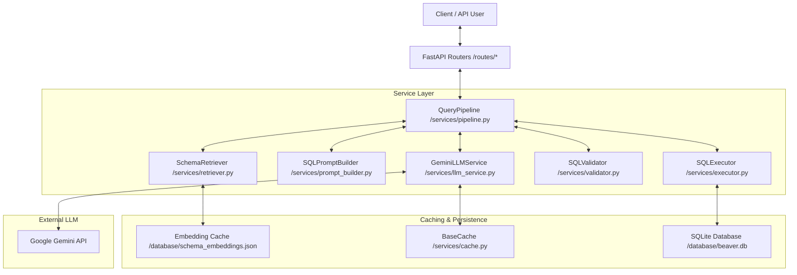
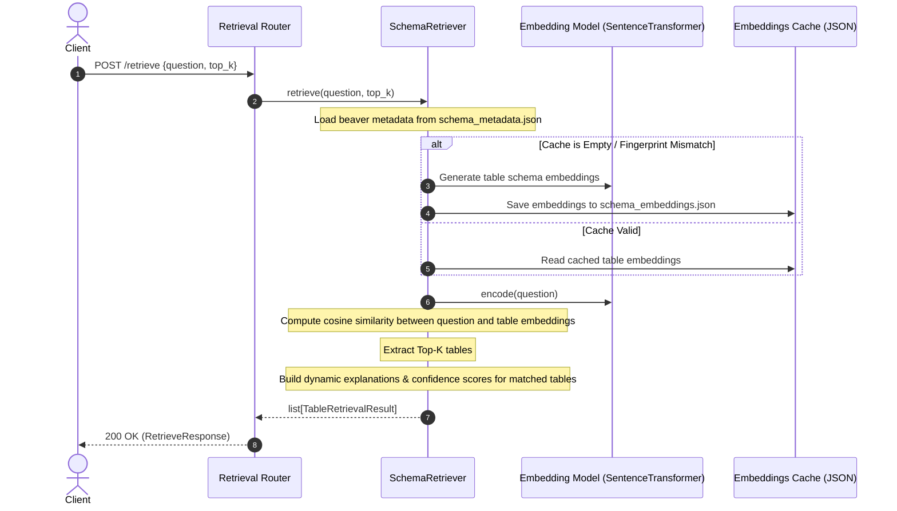
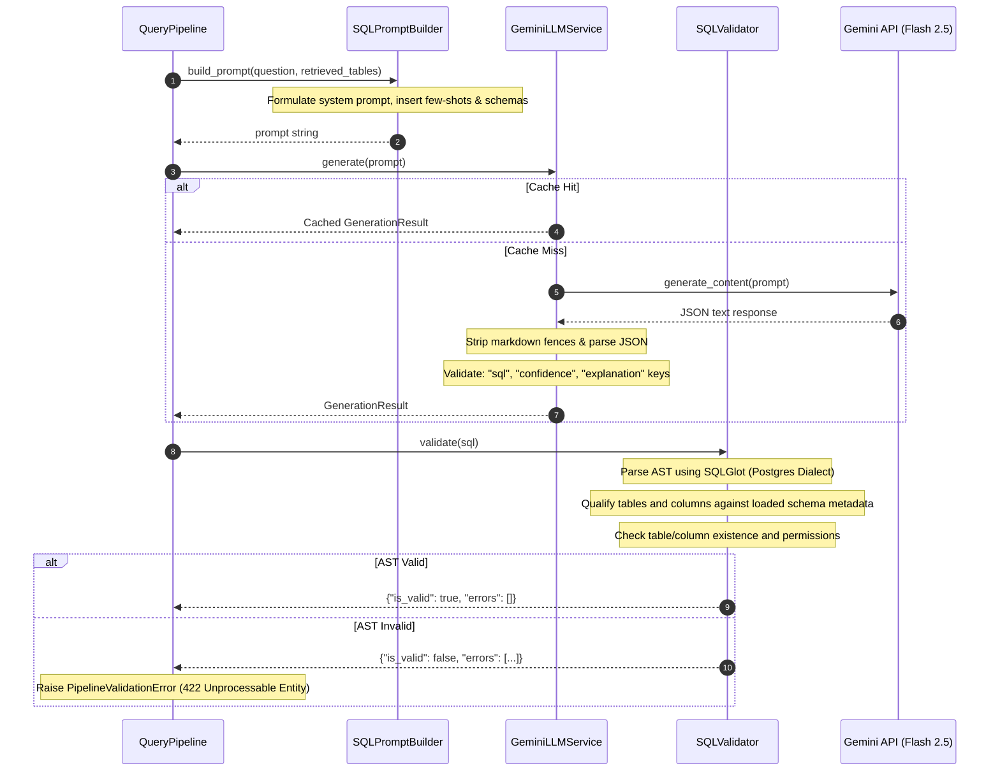
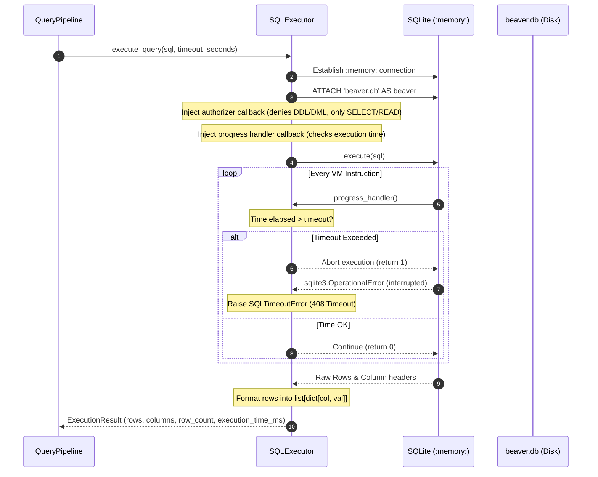

# System Architecture & Workflows

This document details the architectural design, component responsibilities, and runtime workflows of the Enterprise Text-to-SQL API platform.

---

## 1. System Architecture

The platform is designed around a modular, pipeline-oriented architecture implemented in FastAPI. The diagram below illustrates how external clients interact with the API endpoints and how the underlying service layers orchestrate metadata retrieval, LLM query generation, security validation, sandboxed database execution, and caching.

---

## 2. Component Workflows

### A. Schema Retrieval Workflow

The Schema Retrieval stage ensures that the LLM is only supplied with schema definitions relevant to the user's natural language question, preserving context limits and minimizing noise.

---

## 3. SQL Generation & Validation Loop

Once the relevant tables are identified, the pipeline compiles the schema contexts, selects few-shot examples, generates ANSI-compatible SQL via Gemini, and parses the structured explanation.

---

## 4. Sandboxed Query Execution

Queries are executed against the database under strict isolation rules to prevent resource exhaustion and data mutation.

